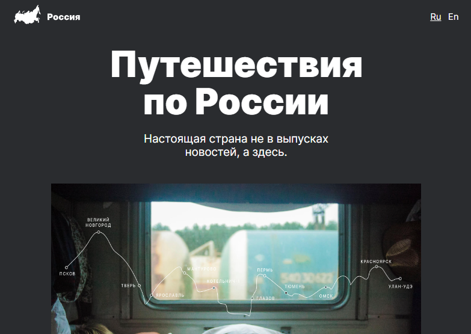
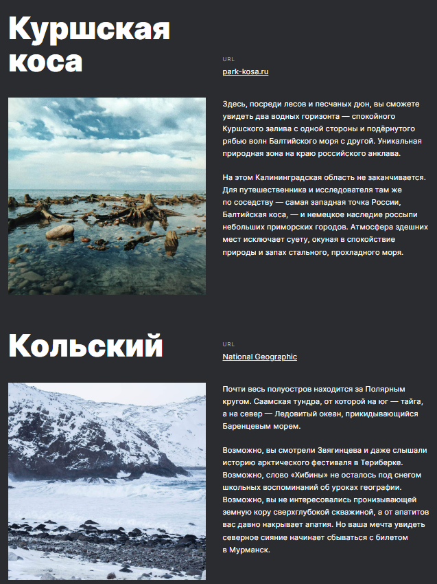
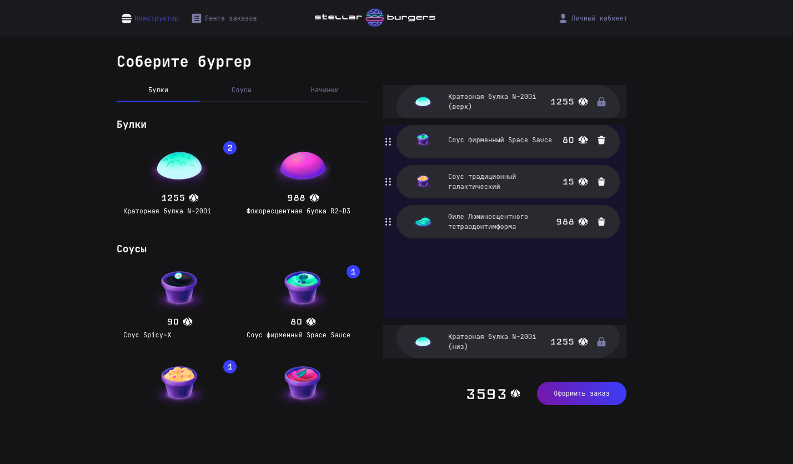

<!---

--->

# Привет, меня зовут Анна! 🖖

**Я Frontend-разработчик**

В ИТ я около 4-х лет. После поступления на курсы по веб разбаботке устроилась работать тестировщиком програмного обеспечения для дизайнеров. Участвовала в тестировании интерфейсов и новых фичей, описывала тесты. В течении года работы получила опыт взаимодействия с командой, вживую увидела флоу разработки приложения в компании. 

Сейчас я выпускница курса ["Web-разработчик+"](https://practicum.yandex.ru/web-plus/). Во время прохождения курса я написала несколько проектов на HTML, CSS и JavaScript, работала с адаптивной вёрсткой. Создала интерактивные приложения с Node.js на React, Redux и TypeScript.

  

    Разверните для просмотра краткой информации о проектах или перейдите в 
    <a href="https://github.com/ann-wi#:~:text=Pinned,Loading">📌 Закрепы</a>
      <ol>
    <li>
      

        🚋 Путешествия по России [
        <a href="https://github.com/ann-wi/russian-travel"> 📂 Репозиторий</a> 
        | <a href="https://ann-wi.github.io/russian-travel/">🌐Сайт</a> ]
      

      <ul style="padding-bottom: 10px">
        <li>Адаптивный интерфейс с использованием Flex, Grid и медиазапросов для обеспечения корректного отображения сайта на различных устройствах.</li>
        <li>Методология БЭМ для улучшения структуры и поддерживаемости кода.</li>
        

          
Скриншоты

          

            
            
            
          

        

      </ul>
    </li>
    <li>
      

        👽 Космическая бургерная 🍔 [
        <a href="https://github.com/ann-wi/react-burger"> 📂 Репозиторий</a> 
        | <a href="https://ann-wi.github.io/react-burger/">Сайт</a> ]
      

      <ul style="padding-bottom: 10px">
        <li>Интерактивное веб-приложение для создания бургеров, управления профилем и отслеживания заказов в реальном времени с помощью WebSocket и REST API.</li>
        <li>Redux и Middleware для эффективного управления состоянием.</li>
        <li>React Router для удобной навигации и работы с заказами, а также react-intersection-observer и Drag-and-drop для улучшения пользовательского опыта.</li>
        

          
Скриншоты

          

            
            
          

        
      
	    </ul>
    </li>
  </ol>
  

В свободное время коллекционирую кукол, вяжу крючком и занимаюсь йогой.

Skills
---

#### 📧 vann2299@yandex.ru | [Telegram](https://t.me/yumi_i) | [📄 Резюме на HH.ru](https://hh.ru/resume/8befb3b0ff0d2cab980039ed1f4e5356706365)